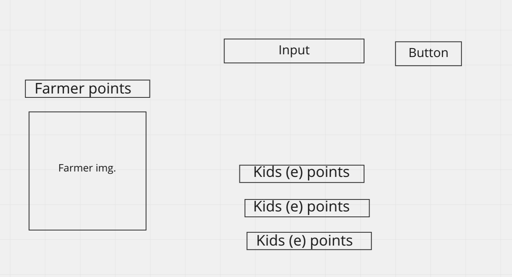

HTML
static:
input
button
farmer img
el
player points el
el to append carrots to

dynamic:
kid div
name
emoji
points

STATE
player points
kids
points
defeated farmer counter

EVENTS
show updates when state changes
click on challenge button
farmer is made with name and given random number for points
push into array

click on farmers
either cowpie is added or taken away
either farmer or kids cowpie is added or taken away

update emoji
update hp for farmer and kids
